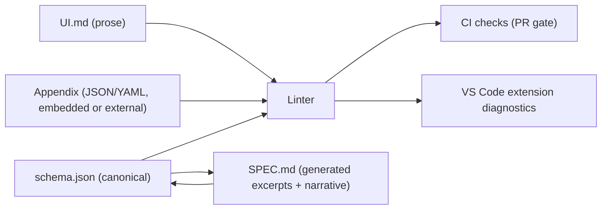
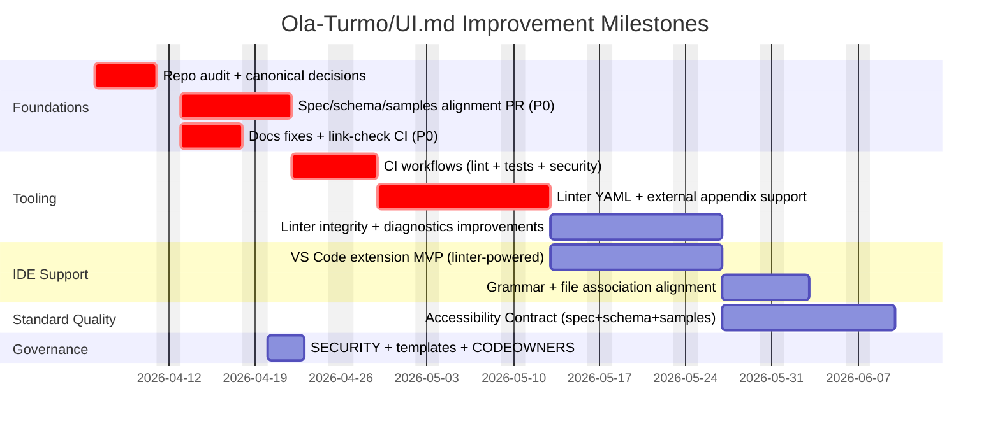

# Product Requirements Document for Improving Ola-Turmo/UI.md

## Executive summary

**Enabled connectors used (per request): GitHub.**  
This PRD is based on a deep inspection of the **single GitHub repository** `Ola-Turmo/UI.md` (docs, tooling, and samples). fileciteturn5file0L1-L1

The repository presents a compelling product idea: **UI.md as a machine-verifiable “behavioral UX/UI contract”** that keeps humans and AI agents aligned across screens, states, interactions, and data needs. fileciteturn5file0L1-L1 fileciteturn6file0L1-L1 However, the repo’s **biggest adoption blocker** is **spec/tooling/documentation drift**—multiple internal inconsistencies make it hard for contributors and downstream implementers to know “what is canonical,” and they materially weaken trust in the standard.

The highest-impact improvements are:

1. **Make the standard self-consistent and machine-source-of-truth aligned** (SPEC ↔ schema.json ↔ linter ↔ samples ↔ VS Code extension). Today, these components disagree on key primitives like allowed state types and navigation semantics (e.g., “Pop”), and they also disagree on appendix format support (JSON vs YAML). fileciteturn6file0L1-L1 fileciteturn17file0L1-L1 fileciteturn19file0L1-L1
2. **Upgrade the linter from “reference script” into a reliable compatibility gate** (YAML support, optional external appendix files, tighter referential integrity checks, clearer errors, tests, CI). The current linter only extracts a JSON appendix and intentionally skips some integrity checks; this contradicts the broader spec positioning and documentation promises. fileciteturn18file0L1-L1 fileciteturn24file0L1-L1
3. **Bring the VS Code extension up to “usable MVP”** by aligning file associations, validation logic, grammar rules, and manifest correctness with VS Code requirements and with the actual UI.md conventions used in samples. fileciteturn15file0L1-L1 fileciteturn26file0L1-L1 fileciteturn31file0L1-L1 citeturn2search0turn2search1
4. **Add repo health essentials** (CI workflows, security policy, code owners, PR/issue templates, branch protection expectations, dependency/security scanning posture). GitHub explicitly supports SECURITY.md and standardized issue/PR templates to improve contributor workflows and vulnerability reporting. citeturn1search1turn2search2

A key product addition that would strongly differentiate UI.md is to **formalize accessibility requirements as first-class, testable contract fields** (keyboard support, focus management, drag alternatives per WCAG 2.2, etc.), anchored to WCAG and WAI-ARIA APG behavioral guidance. citeturn0search2turn0search3turn3search0

## Scope and objectives

### In scope

This PRD covers improvements to the `Ola-Turmo/UI.md` repository across:

- **Specification coherence:** clarify “what is UI.md,” and ensure definitions match examples and tooling behavior. fileciteturn6file0L1-L1
- **Tooling quality:** linter correctness, robustness, performance, packaging, and tests. fileciteturn18file0L1-L1 fileciteturn24file0L1-L1
- **Developer experience:** VS Code extension capability and correctness, contributor workflows, templates, and CI. fileciteturn16file0L1-L1 citeturn2search0turn2search2
- **Accessibility, UX, and UI best practices:** improve the standard so it “bakes in” accessible and consistent interaction contracts, grounded in WCAG 2.2 and WAI-ARIA Authoring Practices patterns (focus behavior, keyboard interaction, etc.). citeturn0search2turn3search0turn4search0turn4search5
- **Security and maintainability:** add SECURITY.md, branch protection guidance, CODEOWNERS, and secure workflow principles for GitHub Actions usage. citeturn1search1turn5search5turn6search5

### Out of scope

Any analysis, recommendations, or examples that hinge on **other GitHub repositories** (explicitly disallowed in the request). External comparisons are limited to **official standards and documentation** (W3C, Apple, Google Material docs, VS Code docs, GitHub Docs, etc.). citeturn0search2turn3search0turn2search0turn1search1

### Objectives

Improve the repo so that:

- A new adopter can follow the README and produce a UI.md that **passes validation** on first attempt. fileciteturn5file0L1-L1
- A contributor can confidently change the standard without accidentally breaking tooling because **spec ↔ schema ↔ linter ↔ samples** are programmatically kept in sync. fileciteturn6file0L1-L1 fileciteturn17file0L1-L1
- UI.md materially helps teams produce **accessible UIs by default**, aligned with WCAG 2.2 and established interaction patterns (e.g., modal focus containment). citeturn0search2turn3search0turn4search0

## Current state assessment and detailed findings

### Repository intent and current assets

The repo’s README positions UI.md as a single Markdown file that describes screens, states, interactions, and data contracts, plus a machine-readable appendix validated by tooling. fileciteturn5file0L1-L1 The SPEC expands the conceptual model and defines what UI.md “covers” vs “excludes,” and claims the appendix can be JSON or YAML and can be embedded or separate. fileciteturn6file0L1-L1

The repo includes:
- A **linter** (`tooling/ui-md-linter/ui-md-lint.js`) and a **schema** (`tooling/ui-md-linter/schema.json`). fileciteturn18file0L1-L1 fileciteturn17file0L1-L1
- A **VS Code extension scaffold** (`tooling/vscode-extension/*`). fileciteturn16file0L1-L1 fileciteturn26file0L1-L1
- Multiple **samples** demonstrating different product types, including drag-and-drop (Kanban), mobile onboarding, and keyboard-driven CLI dashboards. fileciteturn19file0L1-L1 fileciteturn20file0L1-L1 fileciteturn21file0L1-L1

### Detailed findings mapped to repo files and sections

The table below lists the most important gaps and how to fix them. (Section references use headings and stable file paths; line-level citations reference the retrieved file content.)

| Area | Current behavior/evidence | Why it matters | Proposed improvement |
|---|---|---|---|
| Spec ↔ schema mismatch: allowable **state types** | SPEC’s state type set is presented as limited (e.g., loading/empty/error/success/offline/permission-denied). fileciteturn6file0L1-L1 But the actual schema allows many additional types (idle, scrollback, editing, search-active, streaming, refreshing, etc.). fileciteturn17file0L1-L1 Samples (CLI dashboard) actively use those extra types. fileciteturn21file0L1-L1 | Implementers won’t know whether those are “valid.” This creates tool/spec drift and breaks interoperability promises. | Decide canonical policy: either (A) broaden the spec’s normative type set to include what schema + samples allow, or (B) tighten schema/samples to match the spec; publish as **v1.1** with migration notes. |
| Spec ↔ schema mismatch: navigation **back stack semantics** | SPEC enumerates back stack values without “Pop”, while schema includes `Pop` and samples use Pop heavily. fileciteturn6file0L1-L1 fileciteturn17file0L1-L1 fileciteturn19file0L1-L1 | “Back-stack” is a core navigation primitive. If naming differs, tooling and human interpretation diverge quickly. | Adopt explicit, minimal vocabulary: `Push`, `Pop`, `Replace`, `Modal`, `No` (or similar), and update SPEC, schema, and samples together. |
| ID format inconsistency and confusing terminology | SPEC claims `SCREEN-<PascalCaseName>` but shows mixed examples like `SCREEN-login` and `SCREEN-documentList`. fileciteturn6file0L1-L1 Samples use `SCREEN-board`, `SCREEN-accountType`, etc. fileciteturn19file0L1-L1 | Naming conventions are the “glue” between multi-agent contributors. Ambiguity undermines linting and collaboration. | Replace “PascalCase” language with a precise definition (e.g., **lowerCamelCase** or **kebab-case**) and add a linter rule for “one style per file” (warn → error in next major). |
| Appendix format support mismatch (JSON vs YAML, embedded vs separate) | SPEC allows appendix to be embedded JSON/YAML or separate file. fileciteturn6file0L1-L1 Linter only extracts a JSON fenced code block. fileciteturn18file0L1-L1 README Quick Start shows a YAML appendix file concept. fileciteturn5file0L1-L1 | This is a direct “footgun”: users follow docs and then linter fails. | Linter must support: embedded JSON, embedded YAML, and a referenced external appendix file. Also clarify in README what’s supported “now” vs “planned.” |
| Documentation drift: references to an older repo name/URL | Multiple docs mention cloning `ui-md-standard.git` or link to `Ola-Turmo/ui-md-standard`. fileciteturn16file0L1-L1 fileciteturn8file0L1-L1 fileciteturn7file0L1-L1 | Broken/incorrect repository references degrade trust and block adoption. | Normalize all references to `Ola-Turmo/UI.md` and ensure relative links resolve. Add automated link checking in CI. |
| Tooling version and prerequisites inconsistencies | Repo README says Node.js ≥18 for linter. fileciteturn5file0L1-L1 Linter README says Node.js 14+ and “no installation required.” fileciteturn24file0L1-L1 README also suggests `npm install -g ui-md-linter` and `npx ui-md-linter`. fileciteturn5file0L1-L1 | Conflicting prerequisites and install paths cause onboarding failure. | Define a single supported Node range (recommend current LTS), and pick one install path: published npm package or “node script only.” Update all docs consistently. |
| VS Code extension correctness: manifest + behavior | Extension manifest exists but lacks fields expected for a functional extension (notably `main` for code entry). fileciteturn15file0L1-L1 VS Code docs describe required/expected manifest fields and activation best practices. citeturn2search0turn2search1 | Without a correct manifest and declared contributions, commands/activation can be unreliable or missing. | Add `main`, declare commands/menus, align engines version realistically, and add a build/package process. |
| VS Code extension validation logic disagrees with standard | The extension checks for headings like `## Screen Inventory` and `## Navigation Graph`. fileciteturn26file0L1-L1 But samples and linter require numbered sections (`## 3. Screen Inventory`, `## 4. Navigation Model`). fileciteturn19file0L1-L1 fileciteturn18file0L1-L1 | The extension will incorrectly report valid UI.md files as invalid, or miss real errors. | Reuse the linter as the single validation engine (as a library), and only keep minimal VS Code glue code. |
| VS Code syntax highlighting patterns conflict with samples | TextMate grammar highlights `SCREEN-[A-Z]...` and `STATE-[A-Z]...`, but samples use lowercase after prefix (e.g., `SCREEN-board`, `STATE-empty-board`). fileciteturn31file0L1-L1 fileciteturn19file0L1-L1 | Poor highlighting reduces usability and increases authoring errors. | Update grammar and language configuration so the extension matches the repo’s canonical naming convention (post-alignment). |
| Accessibility not first-class in the contract | Accessibility appears in some pattern examples, but there is no consistent, required per-screen/per-pattern accessibility field set. fileciteturn6file0L1-L1 Accessibility standards emphasize keyboard operability and robust focus behavior; WAI-ARIA APG specifies modal dialog focus containment and return focus behavior. citeturn0search2turn3search0 | If UI.md is a behavioral contract, accessibility behaviors (keyboard alternatives, focus order, “dragging movements” alternatives) should be declarative and testable. WCAG 2.2 adds requirements like Dragging Movements and Target Size that map directly to interaction specs. citeturn0search3turn4search0turn4search5 | Add an “Accessibility Contract” section with normative requirements, and extend schema/linter to validate presence and basic completeness of accessibility fields. |
| Repo hygiene: `.factory` artifacts appear stale/misleading | `.factory/validation/*/synthesis.json` includes “fail” claims that contradict the current repo state (e.g., claiming schema empty, VS Code extension missing fields). fileciteturn27file0L1-L1 fileciteturn28file0L1-L1 | Stale artifacts reduce credibility and confuse contributors about repo health. | Either remove `.factory` from main, regenerate it in CI, or document it explicitly (what generates it, when to trust it). |

## Proposed requirements and improvements

### Proposed “single source of truth” architecture

A core requirement is to make the standard **self-consistent** and prevent future drift by design.



**Design principle:** `tooling/ui-md-linter/schema.json` becomes the canonical machine contract, and SPEC.md references it and includes generated excerpts to avoid copy/paste drift. fileciteturn6file0L1-L1 fileciteturn17file0L1-L1

### Current vs proposed state table

| Capability | Current state | Proposed state |
|---|---|---|
| Canonical source of truth | Ambiguous between SPEC.md, schema.json, samples, and tooling behavior. fileciteturn6file0L1-L1 fileciteturn17file0L1-L1 | `schema.json` is canonical; SPEC references it; CI enforces alignment and regenerates spec excerpts. |
| Appendix formats | Linter supports embedded JSON only. fileciteturn18file0L1-L1 | Embed JSON or YAML; optionally external appendix file; resolve via explicit convention and/or frontmatter reference; YAML parsing aligned with YAML 1.2. citeturn6search4 |
| Navigation semantics | Spec and samples/tooling disagree on “Pop” and related vocabulary. fileciteturn6file0L1-L1 fileciteturn19file0L1-L1 | One vocabulary across all artifacts; migration guide for any breaking edits. |
| Accessibility contract | Mentioned inconsistently; not validated. fileciteturn6file0L1-L1 | Required “Accessibility Contract” section + schema fields; aligns with WCAG 2.2 and APG interaction patterns, including focus management for modals. citeturn0search2turn3search0 |
| VS Code extension | Misaligned file association, simplistic validation, highlighting mismatches. fileciteturn26file0L1-L1 fileciteturn31file0L1-L1 | Production-grade MVP: correct manifest and activation, real diagnostics by calling linter library, accurate grammar/test coverage per VS Code docs. citeturn2search0turn2search1 |
| CI/CD | No workflow files detected; CI is only described in docs. fileciteturn7file0L1-L1 | GitHub Actions workflows: lint samples + docs, run tests, link check, package validation, security scanning posture and hardened workflows guidance. citeturn6search5turn7search0 |
| Security + community health | LICENSE present, but no SECURITY.md and no standardized templates detected. fileciteturn9file0L1-L1 | Add SECURITY.md and standardized issue/PR templates; add CODEOWNERS; document branch protection and review expectations. citeturn1search1turn2search2turn5search5 |

### Requirements by workstream

#### Documentation and coherence requirements

1. **Repo identity and links must be correct everywhere.** Replace all references to older repo names/URLs in README, AGENTS.md, CONTRIBUTING.md, and tooling docs and ensure links render correctly on GitHub. fileciteturn16file0L1-L1 fileciteturn8file0L1-L1 fileciteturn7file0L1-L1  
   **Acceptance criteria:** a CI “link check” job passes on PRs; README Quick Start works end-to-end.

2. **One consistent install story for the linter.** Either:
   - (Preferred) publish an npm package and make `npx ui-md-linter` real, or  
   - keep it “repo script only” and remove global install claims.  
   Today, README suggests global install/npx while the linter README says “no installation required.” fileciteturn5file0L1-L1 fileciteturn24file0L1-L1  
   **Acceptance criteria:** A new user can run exactly one documented command and validate the samples.

3. **Make section naming consistent across docs, linter, and extension.** The extension looks for `## Screen Inventory` while the standard samples include `## 3. Screen Inventory` and `## 4. Navigation Model`. fileciteturn26file0L1-L1 fileciteturn19file0L1-L1  
   **Acceptance criteria:** A UI.md file following the official template is recognized as valid by both linter and extension.

#### Spec and schema alignment requirements

1. **Define canonical enumerations and patterns** (state types, backStack values, ID formats). Today, schema and samples allow more than SPEC text implies. fileciteturn6file0L1-L1 fileciteturn17file0L1-L1 fileciteturn21file0L1-L1  
   **Acceptance criteria:** A generated “conformance matrix” in CI confirms:
   - SPEC enumerations == schema enumerations
   - samples validate with zero warnings/errors
   - extension tokenization highlights IDs correctly

2. **Add versioning discipline.** CONTRIBUTING already describes version bump policy and last updated date, but SPEC needs explicit changelog and migration notes where breaking. fileciteturn8file0L1-L1  
   **Acceptance criteria:** SPEC contains a “Changelog” section; schema has a `version` and clear compatibility policy.

#### Linter requirements

1. **Appendix format support:** parse JSON and YAML appendices. YAML spec 1.2 defines YAML as a human-friendly serialization language, and is commonly used for structured config; UI.md already frames YAML as an option. fileciteturn6file0L1-L1 citeturn6search4  
   **Acceptance criteria:** A UI.md with an embedded YAML appendix passes. Another with an external `ui-appendix.yaml` referenced passes.

2. **Improve referential integrity checks** beyond the current “screen IDs only” approach. The linter explicitly skips state ID referential checking today. fileciteturn18file0L1-L1  
   **Acceptance criteria:** Linter validates:
   - every `STATE-*` referenced by screens exists in appendix states
   - every `ROLE-*` referenced exists in appendix roles
   - entity references resolve (`ENTITY-*` types exist)
   - navigation edges referencing `SCREEN-*` resolve

3. **Correctness and compliance:** replace the homegrown partial JSON Schema validator with a standards-compliant validator or explicitly document limitations. JSON Schema evolves over time; the project should state which draft it supports and validate accordingly. citeturn6search0  
   **Acceptance criteria:** Linter passes a test suite including schema edge cases and rejects invalid inputs consistently.

4. **Testing and CI:** add a test harness (unit + golden tests) and run it in CI; the linter is already positioned as a gate for quality. fileciteturn24file0L1-L1  
   **Acceptance criteria:** tests run on PR; required checks are enforced via branch protection. GitHub supports branch protection to require passing status checks. citeturn7search0

#### VS Code extension requirements

1. **Manifest correctness and marketplace readiness.** VS Code documents required/standard fields for `package.json` manifest and activation events. citeturn2search0turn2search1  
   **Acceptance criteria:** extension has correct `main`, declares contributed commands, and activation aligns with contributed language behavior.

2. **Real diagnostics:** extension must call the linter engine, not re-implement partial checks by substring search. fileciteturn26file0L1-L1  
   **Acceptance criteria:** opening any sample shows zero diagnostics; injecting a known error shows precise diagnostics with actionable fixes.

3. **Correct file association:** support both `UI.md` (canonical name in docs/samples) and `.ui.md` (extension-specific), or formally choose one and update docs/samples accordingly. fileciteturn5file0L1-L1 fileciteturn19file0L1-L1 fileciteturn15file0L1-L1  
   **Acceptance criteria:** the extension activates on and highlights the repo’s sample files out of the box.

#### Accessibility and UX requirements in the standard

1. **Introduce a normative Accessibility Contract.** WCAG 2.2 is a W3C Recommendation and emphasizes testable success criteria for accessible content and interactions; it also adds new criteria relevant to UI behavior (e.g., dragging alternatives). citeturn0search0turn0search2turn0search3  
   **Acceptance criteria:** every `SCREEN-*` must declare:
   - keyboard operability expectations (at minimum, all primary actions keyboard accessible)
   - focus order notes for key flows
   - error identification and recovery patterns

2. **Formalize modal and focus behavior guidance.** WAI-ARIA APG’s modal dialog pattern describes focus containment within a modal, initial focus placement, `Escape` behavior, and returning focus to the invoker. citeturn3search0turn3search1  
   **Acceptance criteria:** any navigation edge with “Modal” must include:
   - initial focus target rule
   - focus return target rule
   - keyboard close behavior (`Escape`) and close affordance requirement

3. **Align interaction patterns with platform guidance.** Apple’s HIG emphasizes designing for accessibility (including sufficient control size and keyboard access where applicable). citeturn4search0 Material Design accessibility guidance highlights focus order and focus indicators. citeturn4search5  
   **Acceptance criteria:** samples include an “Accessibility” subsection for at least:
   - drag-and-drop patterns (keyboard alternative)
   - onboarding “Next” flows (focus and error messaging)
   - CLI keyboard navigation (already strong—make it systematically required)

#### Repo governance, security, and maintainability requirements

1. **Add a SECURITY.md** detailing how to report vulnerabilities. GitHub documents SECURITY.md as the mechanism to provide vulnerability reporting instructions. citeturn1search1turn1search2  
   **Acceptance criteria:** SECURITY.md exists and is linked from README.

2. **Add templates:** issue templates and pull request templates are supported by GitHub to standardize contribution inputs. citeturn2search2  
   **Acceptance criteria:** `.github/ISSUE_TEMPLATE/*` and `.github/PULL_REQUEST_TEMPLATE.md` exist and match the repo’s change taxonomy (spec vs tooling vs docs). fileciteturn8file0L1-L1

3. **Add CODEOWNERS + branch protection guidance.** GitHub supports CODEOWNERS to require review from responsible parties. citeturn5search5  
   **Acceptance criteria:** CODEOWNERS exists; CONTRIBUTING specifies expected protected-branch rules.

4. **Secure CI posture:** GitHub provides “security hardening for GitHub Actions” guidance; workflows should follow least privilege. citeturn6search5  
   **Acceptance criteria:** workflows pin permissions, avoid unnecessary secrets exposure, and document third-party action usage policy.

## Delivery plan, timelines, effort, and priorities

### Prioritized backlog with impact, effort, risk

Effort estimates assume 1 engineer-week ≈ 30–35 focused hours (docs + coding + review). “Owners” are placeholders per request.

| Priority | Epic / deliverable | Impact | Effort | Risk | T‑shirt | Rough hours | Owner |
|---|---|---:|---:|---:|---:|---:|---|
| P0 | Spec ↔ schema ↔ samples alignment (state types, backStack values, ID conventions) | High | Med | Med | L | 40–60h | Spec Lead + Tooling Lead |
| P0 | Repair docs drift (repo links, install story, prerequisites) + add link-check CI | High | Low | Low | S | 10–20h | Docs Owner |
| P0 | Add CI workflows: lint samples + tests + basic security posture | High | Med | Low | M | 20–35h | DevOps Owner |
| P1 | Linter: YAML appendix + external appendix support | High | Med | Med | M | 30–50h | Tooling Lead |
| P1 | Linter: stronger referential integrity (states/roles/entities), improved diagnostics | High | Med | Med | M | 30–50h | Tooling Lead |
| P1 | VS Code extension MVP: correct manifest, file association, linter-powered diagnostics | High | Med | Med | M | 35–60h | IDE Owner |
| P2 | Accessibility Contract: spec + schema changes + sample updates | High | Med | Med | L | 50–80h | Accessibility Owner + Spec Lead |
| P2 | Community health: SECURITY.md, CODEOWNERS, issue/PR templates | Med | Low | Low | S | 8–16h | Maintainer |
| P3 | Clean up or formalize `.factory/` artifacts (remove or regenerate) | Low–Med | Low | Low | S | 6–12h | Maintainer |

### Milestones and timeline

The chart below is a suggested schedule. Mermaid Gantt syntax is defined in Mermaid’s official documentation. citeturn6search1



### Ownership model

Because UI.md is a “contract,” ownership should be explicit:

- **Spec Lead:** owns SPEC.md + versioning + migration notes. fileciteturn6file0L1-L1
- **Tooling Lead:** owns schema.json + linter behavior. fileciteturn17file0L1-L1 fileciteturn18file0L1-L1
- **IDE Owner:** owns VS Code extension and its release process. fileciteturn15file0L1-L1
- **Accessibility Owner:** ensures requirements remain aligned with WCAG/WAI patterns and platform guidance. citeturn0search2turn3search0turn4search0turn4search5
- **Maintainer:** owns repo health files, templates, triage.

## Acceptance criteria, success metrics, and governance

### Acceptance criteria

A release is considered successful when:

- **Consistency gates:** SPEC, schema, linter, and samples agree on enumerations/ID rules, and CI checks enforce it. fileciteturn6file0L1-L1 fileciteturn17file0L1-L1
- **Validation gates:** all sample UI.md files pass linter; breaking changes include migration notes in SPEC and are reflected in samples. fileciteturn19file0L1-L1
- **Appendix compatibility:** linter accepts embedded JSON, embedded YAML, and (if documented) external appendix references; YAML behavior is documented consistently with YAML 1.2 expectations. citeturn6search4
- **VS Code MVP:** opening sample files shows correct highlighting and no false-positive warnings; intentionally invalid files produce accurate diagnostics. citeturn2search0turn2search1
- **Security posture:** SECURITY.md exists, and contributor flows are standardized via templates. citeturn1search1turn2search2

### Success metrics

Track these over time (monthly):

- **Adoption metrics**
  - Number of external projects using UI.md or referencing the spec (proxy: citations/issues/PRs).
  - Linter usage (if published) / CI badge adoption.
- **Quality metrics**
  - CI pass rate on main branch.
  - Number of “doc drift” incidents caught by alignment checks (should trend down).
- **Accessibility completeness**
  - Percentage of sample screens/patterns with fully populated Accessibility Contract fields.
  - Number of accessibility-related lint rules violated (should trend down).
- **Tooling performance**
  - Lint runtime on largest sample; goal: < 1s on a typical GitHub Actions runner for single file (set a budget and alert on regression).

### Risk analysis and mitigations

- **Risk: breaking downstream compatibility via spec tightening.**  
  Mitigation: ship changes as **minor (1.1)** when additive; only do **major (2.0)** for breaking changes, and include migration guidance as implied by the repo’s own contribution policy. fileciteturn8file0L1-L1

- **Risk: accessibility requirements become too implementation-specific.**  
  Mitigation: keep contract fields behavioral (focus move rules, keyboard alternatives) and cite standards for intent; use APG patterns for interaction behaviors (e.g., modal focus trap and return focus) without mandating a specific framework. citeturn3search0turn0search2

- **Risk: YAML parsing introduces security/perf issues.**  
  Mitigation: use safe parsing defaults; restrict YAML features supported; document exact supported subset. (YAML is complex; standardize on a limited subset aligned to YAML 1.2 JSON-compatibility goals.) citeturn6search4

- **Risk: VS Code extension maintenance burden.**  
  Mitigation: treat the extension as thin integration; delegate validation to linter library; align manifest with VS Code expectations and minimize activation. citeturn2search1

### Proposed PR checklist and PR template

GitHub supports PR templates to standardize contributor inputs. citeturn2search2 Below is a proposed template optimized for this repo’s spec/tooling split.

```markdown
## Summary
What change does this PR make, and why?

## Change Type
- [ ] Spec change (normative)
- [ ] Schema/tooling change
- [ ] VS Code extension change
- [ ] Docs-only change
- [ ] Repo governance (templates/security/CI)

## Affected Areas
- [ ] README.md
- [ ] SPEC.md
- [ ] AGENTS.md
- [ ] tooling/ui-md-linter/
- [ ] tooling/vscode-extension/
- [ ] samples/

## Validation
- [ ] Linter passes for all samples
- [ ] Spec ↔ schema alignment check passes
- [ ] Links validated (no broken links)
- [ ] Added/updated tests (if tooling changed)
- [ ] No drift: updated docs where behavior changed

## Accessibility Contract (if spec/samples changed)
- [ ] Keyboard operability documented for new/changed flows (WCAG-aligned)
- [ ] Focus management documented for modals/overlays (APG-aligned)
- [ ] Drag/drop includes non-drag alternative where applicable (WCAG 2.2)

## Risk / Rollout Notes
What could break? Any migration notes or deprecations?
```

### Branch protection and code ownership recommendations

- Enable protection on `main` to require passing status checks (GitHub supports required status checks via branch protection rules). citeturn7search0
- Add CODEOWNERS so spec/tooling changes require reviews from designated maintainers; GitHub documents CODEOWNERS behavior and placement. citeturn5search5
- Add SECURITY.md with vulnerability reporting instructions; GitHub documents SECURITY.md placement and behavior. citeturn1search1turn1search2
