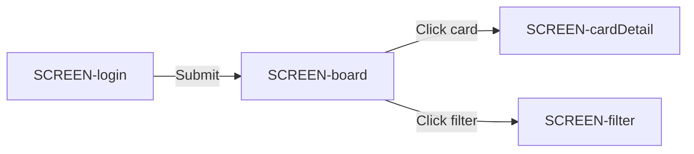

# UI.md Standard Specification

**Version:** 1.1  
**Status:** Stable  
**Machine-Readable Schema:** `tooling/ui-md-linter/schema.json`

---

## 1. Purpose and Scope

### 1.1 What UI.md Is

`UI.md` is a **behavioral UX/UI contract** — a human-readable Markdown file that describes what users see, do, and experience when interacting with a software product. It is:

- **Implementation-independent**: UI.md does not prescribe framework, component library, API paths, or CSS class names
- **Behavior-focused**: UI.md describes user-visible behavior, data needs, state transitions, and interaction rules
- **Machine-verifiable**: A compact JSON/YAML appendix enables deterministic linting and CI validation
- **AI-agent friendly**: Two independent AI agents reading the same UI.md can produce compatible implementations

### 1.2 What UI.md Is Not

UI.md is explicitly not any of the following:

| Document | What It Covers | What UI.md Excludes |
|----------|----------------|---------------------|
| **DESIGN.md** | Visual design language: colors, typography, spacing tokens, iconography, brand guidelines | Visual design tokens, CSS variables, component library specifics |
| **PRD (Product Requirements Doc)** | Product features, business logic, acceptance criteria, release scope | Implementation details, technical architecture |
| **ARCHITECTURE.md** | System components, data flows, infrastructure, API design | User-visible behavior contracts |
| **API.md** | Backend endpoints, request/response payloads, authentication | User-facing data labels, state descriptions |
| **Storybook / Component Catalog** | Reusable UI components, component props, variants | Complete user flows, multi-screen state |

### 1.3 Scope Boundaries

UI.md **covers**:
- Screen inventory with IDs, purposes, and entry/exit conditions
- Navigation graph showing transitions between screens
- State model covering all user-visible states (loading, empty, error, success, offline, permission-denied)
- Interaction patterns describing what users can do (click, drag, type, gesture)
- Data contract specifying user-visible labels, types, constraints, and pagination behavior
- Machine-readable appendix for automated validation

UI.md **excludes**:
- Visual design tokens, color values, typography scales
- Framework-specific component names or library imports
- API endpoint paths, database schemas, backend implementation
- Code snippets, component library usage, CSS class names
- Marketing copy, onboarding text, error message copy (beyond structural patterns)

---

## 2. Relationship to Adjacent Documents

### 2.1 Document Hierarchy

```
PRD ──────────────────────────────────────────────────────────
  │  Business requirements, features, release scope
  ▼
ARCHITECTURE.md ──────────────────────────────────────────────
  │  System design, data model, API contracts
  ▼
UI.md ────────────────────────────────────────────────────────
  │  User-visible behavior, screens, states, interactions
  ▼
DESIGN.md ────────────────────────────────────────────────────
     Visual language, design tokens, component aesthetics
```

### 2.2 Relationship to Each Document

**PRD → UI.md**: The PRD defines what features exist. UI.md defines how those features manifest as user-visible screens and behaviors. If the PRD says "user can search documents," UI.md defines the search screen, its states, and interaction flow.

**ARCHITECTURE.md → UI.md**: Architecture defines the API contracts. UI.md defines what data users see on each screen and what actions they can perform. The data entity schemas in UI.md should map to, but not duplicate, API payloads.

**DESIGN.md → UI.md**: Design provides the visual vocabulary (colors, fonts, spacing). UI.md uses neutral structural language. A UI.md screen titled "Document List" maps to a Design.md component named "DocumentListView" but does not prescribe its visual style.

**API.md → UI.md**: API.md defines endpoints and payloads. UI.md defines what information users see and interact with. The data contract section of UI.md describes user-facing labels and constraints, not internal field names.

**AGENTS.md → UI.md**: AGENTS.md provides AI agent-specific guidance for reading and producing UI.md files. It explains how to interpret the standard, common authoring mistakes, and how to integrate with the linter tooling.

---

## 3. Product Mental Model

### 3.1 Core Principle

A UI.md file is a **behavioral contract** between:
- The **product team** (who defines what users should experience)
- The **frontend team** (who builds the implementation)
- The **AI agents** (who generate, review, or modify UI behavior)

The contract is human-readable for product and human review, and machine-readable for automated validation.

### 3.2 What Makes a Good UI.md

A good UI.md has four properties:

1. **Complete**: Every screen, state, and transition a user can encounter is described
2. **Consistent**: Same terminology, same ID format, same section structure across the file
3. **Implementation-agnostic**: No framework names, no component library references, no API paths
4. **Testable**: The machine-readable appendix enables automated validation

### 3.3 The Human-Machine Contract

UI.md serves two audiences simultaneously:

- **Human readers** get prose descriptions, rationale, and examples in Markdown
- **AI agents and tooling** get structured IDs, typed schemas, and formal state definitions in the appendix

Neither audience should require the other to make sense of the document.

---

## 4. Users and Roles

### 4.1 Defining Users and Roles

Every UI.md must define the distinct user roles that interact with the product. Each role is a category of user with specific permissions, capabilities, and visible UI.

### 4.2 Role Definition Schema

| Field | Type | Required | Description |
|-------|------|----------|-------------|
| `roleId` | string | Yes | Unique identifier, format `ROLE-<name>` |
| `name` | string | Yes | Human-readable role name |
| `description` | string | Yes | What this role does, in 1-2 sentences |
| `capabilities` | string[] | Yes | List of specific capabilities |
| `visibleScreens` | string[] | Yes | Screen IDs this role can access |
| `restrictions` | string[] | No | Actions or data this role cannot access |

### 4.3 Role Examples

**Authenticated User**: A logged-in user with standard access to personal data and shared workspace content.

**Admin**: A privileged user who can manage other users, configure workspace settings, and access administrative surfaces.

**Anonymous Visitor**: An unauthenticated user who can only view public content.

**Guest**: An authenticated user invited to a specific workspace with limited access to that workspace's content.

---

## 5. Screen Inventory

### 5.1 Required Sections

Every UI.md must contain a **Screen Inventory** section that catalogs all screens in the product.

### 5.2 Screen Schema

Each screen entry must include the following fields:

| Field | Type | Required | Description |
|-------|------|----------|-------------|
| `id` | string | Yes | Unique identifier, format `SCREEN-<name>` |
| `purpose` | string | Yes | What this screen does for the user, in 1-2 sentences |
| `primaryActions` | string[] | Yes | The 2-5 most important actions a user can take on this screen |
| `entryConditions` | string[] | Yes | What must be true before this screen is shown |
| `exitConditions` | string[] | Yes | What happens when the user leaves this screen |
| `states` | string[] | Yes | All state IDs that can appear on or affect this screen |
| `roleAccess` | string[] | Yes | Which roles can access this screen |

### 5.3 Screen ID Naming Convention

- Format: `SCREEN-<PascalCaseName>`
- Examples: `SCREEN-login`, `SCREEN-documentList`, `SCREEN-cardDetail`
- IDs must be unique within the document
- IDs must be referenced consistently in the navigation graph and appendix

### 5.4 Screen Entry Example

```markdown
### SCREEN-board

**Purpose**: Display the Kanban board with all columns and cards.

**Primary Actions**:
- Open a card by clicking on it
- Drag a card to a different column
- Create a new card via the column header button
- Open the filter panel

**Entry Conditions**:
- User is authenticated
- User has access to the board
- Board data has been loaded (STATE-success on initial load)

**Exit Conditions**:
- User navigates to SCREEN-cardDetail (opens card)
- User navigates to SCREEN-settings (opens settings)
- User logs out (returns to SCREEN-login)

**States**: STATE-empty-board, STATE-loading, STATE-success, STATE-error, STATE-offline

**Role Access**: ROLE-authenticated
```

### 5.5 Required Screen Categories

Every product UI.md should include screens covering these functional areas:

1. **Authentication screens**: Login, registration, password reset, logout confirmation
2. **Primary workspace**: The main interface where users accomplish their primary goals
3. **Detail views**: Modal, panel, or dedicated screen for viewing/editing a single item
4. **Creation flows**: Screen or modal for creating new items
5. **Settings/preferences**: User and workspace configuration screens
6. **Error/empty states**: Screens that handle exceptional conditions

---

## 6. Navigation Model

### 6.1 Navigation Graph Format

The navigation model is expressed as a directed graph. Each edge represents a possible transition from one screen to another.

### 6.2 Navigation Entry Format

The navigation graph may be expressed as:

**Markdown table format** (preferred for readability):

| From | To | Trigger | Condition | Back Stack |
|------|----|---------|-----------|------------|
| SCREEN-login | SCREEN-board | Submit credentials | Auth success | No |
| SCREEN-board | SCREEN-cardDetail | Click card | Card selected | Push |
| SCREEN-board | SCREEN-filter | Click filter button | — | Push |

**Mermaid diagram format** (for complex flows):



### 6.3 Navigation Field Definitions

| Field | Description |
|-------|-------------|
| `from` | Source screen ID |
| `to` | Destination screen ID |
| `trigger` | User action or system event that initiates the transition |
| `condition` | Optional prerequisite that must be met (e.g., "Auth success", "Permission granted") |
| `backStack` | `Push` (adds to back stack), `Replace` (replaces current), `No` (not added) |

### 6.4 Navigation Categories

**Linear navigation**: Sequential step-by-step flows (e.g., onboarding wizard)

**Hierarchical navigation**: Parent-child screen relationships with back-stack behavior

**Modal/overlay navigation**: Transient screens that return to the underlying screen

**Conditional navigation**: Different destinations based on state, role, or data

### 6.5 Back-Stack Behavior

| Behavior | Description |
|----------|-------------|
| `Push` | New screen added to back stack; back button returns to previous |
| `Replace` | Current screen replaced; back button skips to screen before |
| `No` | Transition does not affect back stack (e.g., logout, auth redirects) |
| `Modal` | Overlay screen; back button or dismissal returns to previous without transition |

### 6.6 Entry and Terminal Screens

- **Entry points**: Screens that can be the first screen shown (e.g., `SCREEN-login` for unauthenticated users, `SCREEN-board` for authenticated users)
- **Terminal screens**: Screens that end a flow (e.g., `SCREEN-logoutConfirmation`, `SCREEN-error`)
- **Conditional routing**: The navigation model must specify how entry point selection works (e.g., "if authenticated → SCREEN-board, else → SCREEN-login")

---

## 7. Core User Flows

### 7.1 Purpose

Core user flows describe the primary tasks users accomplish, expressed as sequences of screens and interactions.

### 7.2 Flow Description Format

Each flow is described as:

1. **Flow name and ID**: Unique identifier and clear name
2. **User goal**: What the user is trying to accomplish
3. **Prerequisites**: What must be true before starting this flow
4. **Step-by-step description**: Numbered steps with screen references
5. **Success outcome**: What happens when the flow completes
6. **Failure outcomes**: What can go wrong and how errors are handled

### 7.3 Flow Example

**FLOW-createCard**

**Goal**: Create a new card on the Kanban board.

**Prerequisites**: User is authenticated and viewing the board (SCREEN-board in STATE-success).

**Steps**:
1. User clicks the "+" button on any column header on SCREEN-board
2. System transitions to SCREEN-createCard
3. User enters card title (required), description (optional), and selects assignee
4. User clicks "Create"
5. System validates input (STATE-field-error if invalid)
6. System creates card and transitions back to SCREEN-board in STATE-success
7. New card appears in the selected column

**Success**: Card created, visible in correct column, user returned to board.

**Failure**: Validation error (shows STATE-field-error), network error (shows STATE-error with retry option).

---

## 8. Interaction Patterns

### 8.1 Purpose

Interaction patterns describe how users interact with UI elements — what they can click, type, drag, gesture, or invoke.

### 8.2 Pattern Categories

| Category | Description |
|----------|-------------|
| `PATTERN-click` | Single click, double click, right-click actions |
| `PATTERN-type` | Text input, textarea, search field behavior |
| `PATTERN-drag` | Drag-and-drop behavior, ghost display, drop zones |
| `PATTERN-gesture` | Swipe, pull-to-refresh, pinch, long-press |
| `PATTERN-keyboard` | Tab navigation, shortcuts, Enter/Escape behavior |
| `PATTERN-select` | Single select, multi-select, dropdown behavior |
| `PATTERN-toggle` | Switch, checkbox, radio button behavior |

### 8.3 Pattern Description Format

Each pattern includes:

- **Pattern ID**: Format `PATTERN-<name>`
- **Trigger**: What user action activates this pattern
- **Visual feedback**: What the user sees during the interaction
- **Result**: What happens after the interaction completes
- **Error handling**: What happens if the interaction fails
- **Accessibility**: Keyboard alternative if applicable

### 8.4 Pattern Example

**PATTERN-dragCard**

**Trigger**: User initiates drag on a card element.

**Visual Feedback**:
- Card becomes semi-transparent (50% opacity)
- Ghost card follows cursor
- Valid drop zones highlight with border
- Invalid drop zones show rejection indicator

**Result**:
- Card moves to new column
- Position updates optimistically (STATE-success)
- Background sync confirms server update

**Error Handling**:
- If server update fails: card returns to original position, STATE-error shown with retry option

**Accessibility**:
- Keyboard alternative: Select card with Enter, move with arrow keys, confirm with Enter

---

## 9. State Model

### 9.1 Purpose

The state model describes all possible states the UI can be in, beyond simple screen presence. States are conditions that affect what users see and can do.

### 9.2 Required State Categories

Every UI.md must define states covering these categories:

| Category | ID Prefix | Description |
|----------|-----------|-------------|
| Loading states | `STATE-loading` | Initial load, refresh, background sync |
| Empty states | `STATE-empty` | No data, filtered empty, first-use |
| Error states | `STATE-error` | Network failure, validation error, permission denied, server error |
| Success states | `STATE-success` | Operation complete, confirmation shown |
| Offline states | `STATE-offline` | Disconnected, reconnecting, cached data stale |
| Permission-denied states | `STATE-permission-denied` | User lacks access to feature or data |

### 9.2.1 Extended State Categories (v1.1)

The following state types extend the base set and may be used for more granular UI modeling:

| Category | ID Prefix | Description |
|----------|-----------|-------------|
| Idle states | `STATE-idle` | User is inactivity, no pending operations |
| Scrollback states | `STATE-scrollback` | User is reviewing historical content |
| Editing states | `STATE-editing` | User is actively modifying content |
| Search-active states | `STATE-search-active` | Search query is active with results |
| Streaming states | `STATE-streaming` | Real-time data being received |
| Refreshing states | `STATE-refreshing` | Data is being refreshed in place |
| Field-selected states | `STATE-field-selected` | A specific field has focus |

### 9.3 State Schema

| Field | Type | Required | Description |
|-------|------|----------|-------------|
| `id` | string | Yes | Unique identifier, format `STATE-<name>` |
| `type` | string | Yes | Category: `loading`, `empty`, `error`, `success`, `offline`, `permission-denied`, `idle`, `scrollback`, `editing`, `search-active`, `streaming`, `refreshing`, `field-selected` |
| `description` | string | Yes | What this state means and when it occurs |
| `userMessage` | string | No | What the user sees (if different from description) |
| `indicators` | string[] | Yes | Visual or behavioral indicators (spinner, empty illustration, error banner) |
| `allowedActions` | string[] | Yes | What actions the user can take in this state |
| `blockedActions` | string[] | No | What actions are unavailable in this state |
| `recoveryAction` | string | No | How to exit this state (e.g., "retry", "refresh", "login") |

### 9.4 State Examples

**STATE-loading**

- **Type**: loading
- **Description**: Data is being fetched from the server.
- **Indicators**: Spinner or skeleton screen, no interactive elements
- **Allowed Actions**: Cancel (if operation is abortable), refresh page
- **Blocked Actions**: Submitting forms, navigating away (may lose data)

---

**STATE-empty-board**

- **Type**: empty
- **Description**: Board exists but has no cards in any column.
- **User Message**: "This board is empty. Create your first card to get started."
- **Indicators**: Empty state illustration, prominent CTA button
- **Allowed Actions**: Create card, navigate to settings
- **Recovery Action**: Create first card

---

**STATE-error**

- **Type**: error
- **Description**: An unexpected error occurred during an operation.
- **User Message**: "Something went wrong. Please try again."
- **Indicators**: Error banner or toast, red accent color
- **Allowed Actions**: Retry, go back, contact support
- **Recovery Action**: Retry operation

---

**STATE-offline**

- **Type**: offline
- **Description**: Network connection is unavailable. Cached data may be shown.
- **User Message**: "You're offline. Some features may be unavailable."
- **Indicators**: Offline indicator badge, muted UI, cached data shown
- **Allowed Actions**: View cached data, retry when online
- **Blocked Actions**: Create or edit (unless optimistic UI with local persistence)
- **Recovery Action**: Retry when connection restored

---

**STATE-permission-denied**

- **Type**: permission-denied
- **Description**: User does not have permission to access this feature or data.
- **User Message**: "You don't have access to this. Contact your administrator."
- **Indicators**: Locked icon, permission denial message
- **Allowed Actions**: Go back, switch workspace (if applicable)
- **Blocked Actions**: The restricted feature

---

**STATE-success**

- **Type**: success
- **Description**: An operation completed successfully.
- **User Message**: "[Operation] completed successfully." (e.g., "Card created")
- **Indicators**: Success toast or confirmation, green accent color
- **Allowed Actions**: Continue, undo (if applicable)
- **Recovery Action**: None needed

---

## 10. Data Contract

### 10.1 Purpose

The data contract describes what user-visible information appears on each screen, what actions users can perform that trigger data changes, and how data pagination, filtering, and sorting work from the user's perspective.

### 10.2 Data Entity Schema

| Field | Type | Required | Description |
|-------|------|----------|-------------|
| `entityId` | string | Yes | Unique identifier, format `ENTITY-<name>` |
| `name` | string | Yes | Human-readable entity name |
| `fields` | object[] | Yes | List of fields with label, type, constraints |
| `screenUsage` | string[] | Yes | Which screens display this entity |
| `operations` | string[] | Yes | CRUD operations available to the user (Create, Read, Update, Delete) |

### 10.3 Field Schema

| Field | Type | Required | Description |
|-------|------|----------|-------------|
| `name` | string | Yes | Field identifier (snake_case) |
| `label` | string | Yes | User-visible label |
| `type` | string | Yes | Data type: `string`, `number`, `date`, `boolean`, `enum`, `array` |
| `constraints` | object | No | Validation constraints |
| `required` | boolean | Yes | Whether this field is required |
| `readOnly` | boolean | Yes | Whether users can edit this field |
| `format` | string | No | Display format hint (e.g., "nb-NO date", "currency") |

### 10.4 Constraints Object

| Field | Type | Description |
|-------|------|-------------|
| `minLength` | number | Minimum string length |
| `maxLength` | number | Maximum string length |
| `min` | number | Minimum numeric value |
| `max` | number | Maximum numeric value |
| `pattern` | string | Regex pattern for string values |
| `enumValues` | string[] | Allowed values for enum type |

### 10.5 Data Entity Example

**ENTITY-card**

```
Fields:
- id: string, readOnly, label "ID"
- title: string, required, maxLength 200, label "Title"
- description: string, maxLength 5000, label "Description"
- assignee: ENTITY-user (reference), label "Assigned to"
- dueDate: date, label "Due date", format "nb-NO date"
- tags: array of strings, label "Tags"
- column: ENTITY-column (reference), label "Column"
- createdAt: date, readOnly, label "Created", format "nb-NO datetime"
- updatedAt: date, readOnly, label "Updated", format "nb-NO datetime"
```

---

**ENTITY-user**

```
Fields:
- id: string, readOnly
- name: string, required, label "Name"
- email: string, required, format "email", label "Email"
- avatar: string (URL), label "Avatar"
```

---

### 10.6 Pagination, Filtering, Sorting

The data contract must specify how data collections behave:

- **Pagination**: Page size, whether cursor-based or offset-based, what "load more" looks like
- **Filtering**: What filterable fields exist, whether filters are applied immediately or on submit
- **Sorting**: What sortable fields exist, default sort order, how sort is indicated in UI

---

## 11. Appendix: Machine-Readable Schema

### 11.1 Purpose

The machine-readable appendix (JSON or YAML) provides a structured, formally typed representation of the UI.md content. It enables automated validation, CI gating, and AI-agent parsing.

### 11.2 Appendix Location

The appendix may be:
- An embedded JSON or YAML code block at the end of the UI.md file
- A separate `.json` or `.yaml` file colocated with the UI.md file
- Referenced via a path (e.g., `ui-md.json`) for tooling compatibility

### 11.3 JSON Schema Fields

```json
{
  "$schema": "http://json-schema.org/draft-07/schema#",
  "title": "UI.md Machine-Readable Appendix",
  "version": "1.1",
  "type": "object",
  "required": ["version", "screens", "states", "navigation", "dataContracts"],
  "properties": {
    "version": {
      "type": "string",
      "pattern": "^\\d+\\.\\d+$",
      "description": "UI.md schema version (e.g., '1.0')"
    },
    "screens": {
      "type": "array",
      "items": {
        "type": "object",
        "required": ["id", "purpose", "primaryActions", "entryConditions", "exitConditions", "states", "roleAccess"],
        "properties": {
          "id": { "type": "string", "pattern": "^SCREEN-[A-Z][a-zA-Z0-9]*$" },
          "purpose": { "type": "string" },
          "primaryActions": { "type": "array", "items": { "type": "string" } },
          "entryConditions": { "type": "array", "items": { "type": "string" } },
          "exitConditions": { "type": "array", "items": { "type": "string" } },
          "states": { "type": "array", "items": { "type": "string", "pattern": "^STATE-" } },
          "roleAccess": { "type": "array", "items": { "type": "string", "pattern": "^ROLE-" } }
        }
      }
    },
    "states": {
      "type": "array",
      "items": {
        "type": "object",
        "required": ["id", "type", "description", "indicators", "allowedActions"],
        "properties": {
          "id": { "type": "string", "pattern": "^STATE-[A-Z][a-zA-Z0-9]*$" },
          "type": { 
            "type": "string", 
            "enum": ["loading", "empty", "error", "success", "offline", "permission-denied"] 
          },
          "description": { "type": "string" },
          "userMessage": { "type": "string" },
          "indicators": { "type": "array", "items": { "type": "string" } },
          "allowedActions": { "type": "array", "items": { "type": "string" } },
          "blockedActions": { "type": "array", "items": { "type": "string" } },
          "recoveryAction": { "type": "string" }
        }
      }
    },
    "navigation": {
      "type": "array",
      "items": {
        "type": "object",
        "required": ["from", "to", "trigger"],
        "properties": {
          "from": { "type": "string", "pattern": "^SCREEN-" },
          "to": { "type": "string", "pattern": "^SCREEN-" },
          "trigger": { "type": "string" },
          "condition": { "type": "string" },
          "backStack": { "type": "string", "enum": ["Push", "Replace", "No", "Modal"] }
        }
      }
    },
    "roles": {
      "type": "array",
      "items": {
        "type": "object",
        "required": ["roleId", "name", "description", "capabilities", "visibleScreens"],
        "properties": {
          "roleId": { "type": "string", "pattern": "^ROLE-[A-Z][a-zA-Z0-9]*$" },
          "name": { "type": "string" },
          "description": { "type": "string" },
          "capabilities": { "type": "array", "items": { "type": "string" } },
          "visibleScreens": { "type": "array", "items": { "type": "string", "pattern": "^SCREEN-" } },
          "restrictions": { "type": "array", "items": { "type": "string" } }
        }
      }
    },
    "dataContracts": {
      "type": "object",
      "additionalProperties": {
        "type": "object",
        "required": ["entityId", "name", "fields", "screenUsage", "operations"],
        "properties": {
          "entityId": { "type": "string", "pattern": "^ENTITY-[A-Z][a-zA-Z0-9]*$" },
          "name": { "type": "string" },
          "fields": {
            "type": "array",
            "items": {
              "type": "object",
              "required": ["name", "label", "type", "required", "readOnly"],
              "properties": {
                "name": { "type": "string" },
                "label": { "type": "string" },
                "type": { "type": "string" },
                "constraints": { "type": "object" },
                "required": { "type": "boolean" },
                "readOnly": { "type": "boolean" },
                "format": { "type": "string" }
              }
            }
          },
          "screenUsage": { "type": "array", "items": { "type": "string", "pattern": "^SCREEN-" } },
          "operations": { "type": "array", "items": { "type": "string", "enum": ["Create", "Read", "Update", "Delete"] } }
        }
      }
    }
  }
}
```

### 11.4 Validation Rules

The appendix must satisfy these constraints:

1. **Version field required**: Every appendix must have a `version` string
2. **Screen IDs unique**: No duplicate screen IDs within a document
3. **State IDs unique**: No duplicate state IDs within a document
4. **Referential integrity**: All `SCREEN-*` references in navigation must exist in `screens`
5. **Referential integrity**: All `STATE-*` references in screens must exist in `states`
6. **Role consistency**: All `ROLE-*` references in screens must exist in `roles`
7. **Data entity references**: All `ENTITY-*` references in field types must exist in `dataContracts`

### 11.5 Schema Compatibility

The appendix schema defined here is compatible with `tooling/ui-md-linter/schema.json`. The linter validates both the Markdown prose structure and the machine-readable appendix.

---

## Appendix A. Quick Reference

### Screen ID Format
```
SCREEN-<PascalCaseName>
Example: SCREEN-documentList, SCREEN-cardDetail
```

### State ID Format
```
STATE-<PascalCaseName>
Example: STATE-loading, STATE-empty-board, STATE-error
```

### State Type Enumerations
```
loading | empty | error | success | offline | permission-denied | idle | scrollback | editing | search-active | streaming | refreshing | field-selected
```

### Role ID Format
```
ROLE-<PascalCaseName>
Example: ROLE-authenticated, ROLE-admin, ROLE-guest
```

### Navigation Back-Stack Values
```
Push | Replace | No | Modal
```

### Data Entity Field Types
```
string | number | date | boolean | enum | array
```

---

## Appendix B. Version History

### v1.1 — State Type Expansion

**Changes:**
- Expanded state type enumerations from 6 to 13 to support richer UI modeling
- Added extended state categories: `idle`, `scrollback`, `editing`, `search-active`, `streaming`, `refreshing`, `field-selected`
- Updated Section 9.2 with new "Extended State Categories (v1.1)" subsection
- Updated Section 9.3 State Schema `type` field to reflect full enumeration
- Updated Appendix A Quick Reference with all 13 state types

**Migration:**
Files authored under v1.0 remain valid under v1.1. The extended state types are **optional**; existing UI.md files using only the original 6 types are fully compliant. No changes required to existing documents.

**Rationale:**
The original 6-type model was sufficient for basic screen states but insufficient for real-time streaming UIs, search-heavy interfaces, and rich text editing contexts. The extended types enable more precise state modeling without breaking existing documents.

---

*End of SPEC.md*
